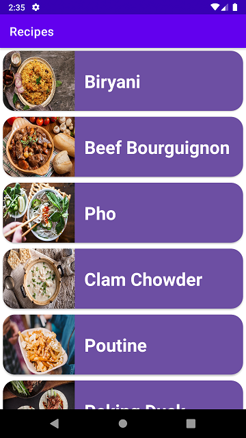
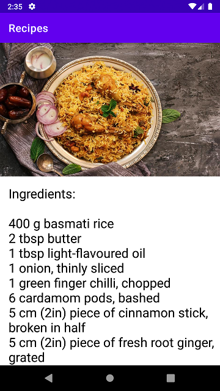

# Recipes Android App

This app uses RecyclerView, CardView and Data Class to display a list of recipes.
Upon clicking an item, an intent is generated to start a new activity with the details of that recipe.

## Screenshots

